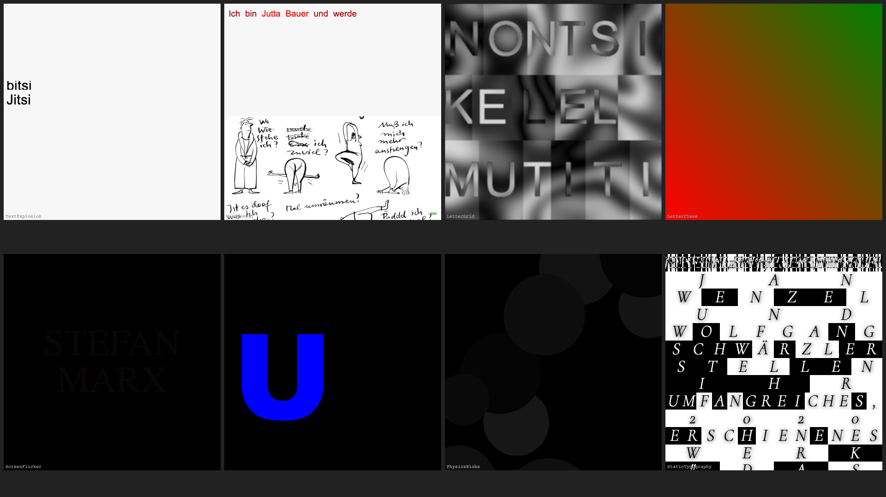
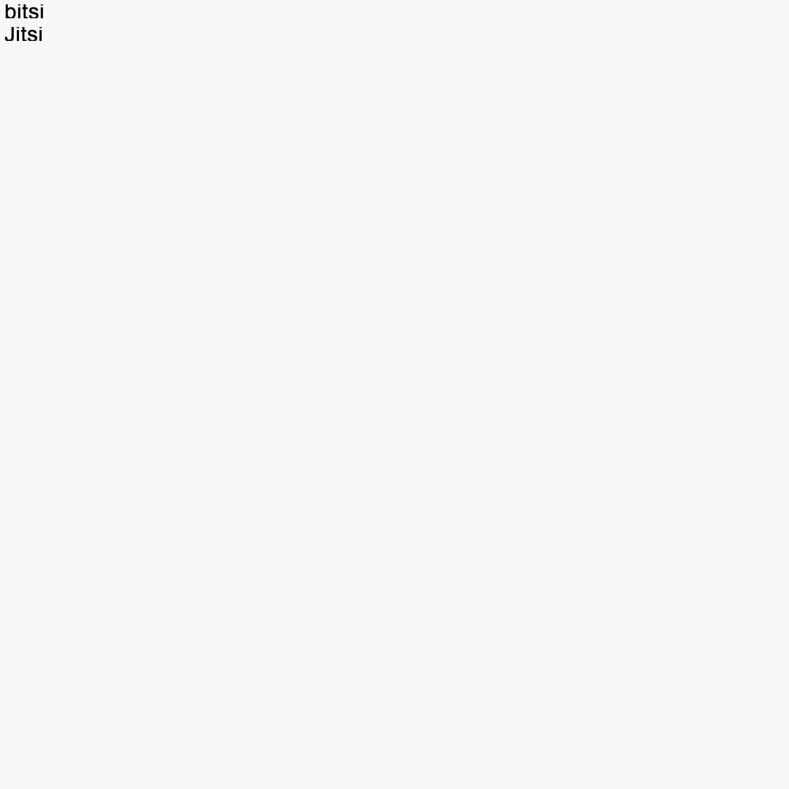
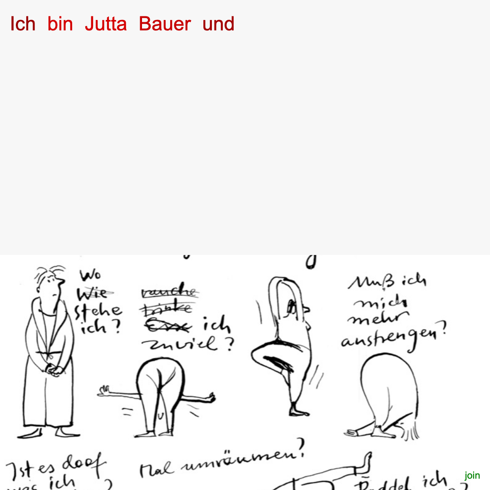
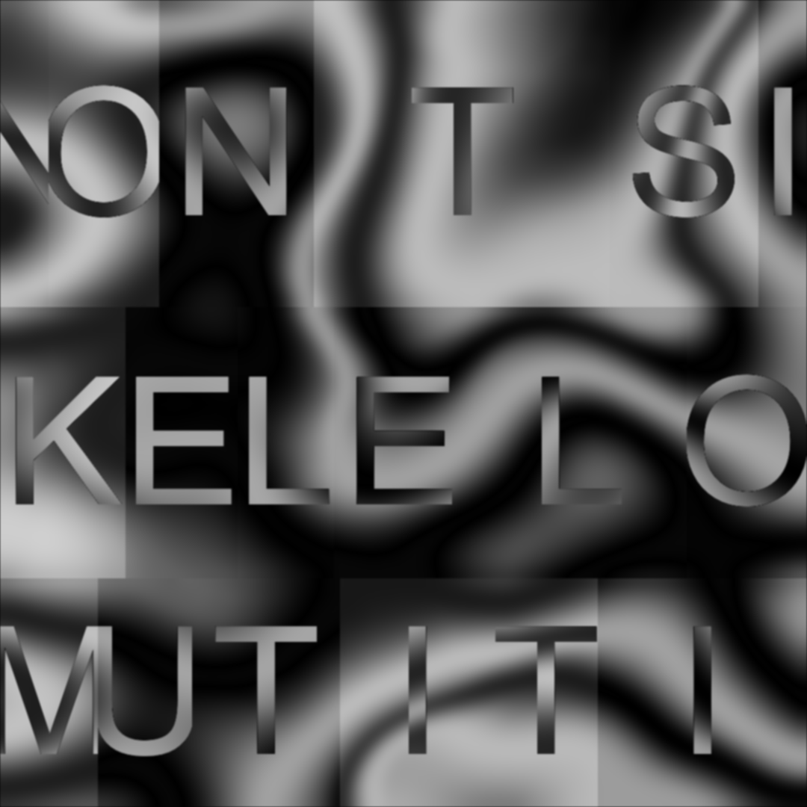
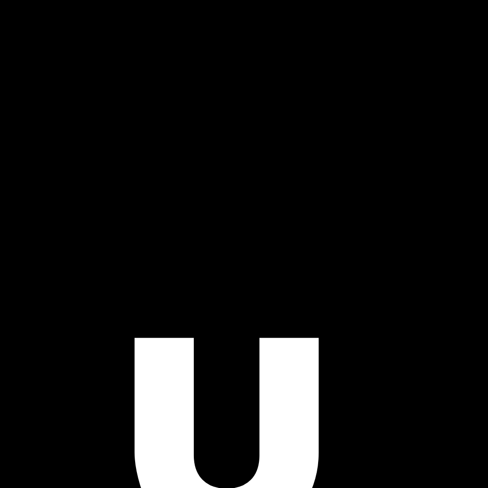
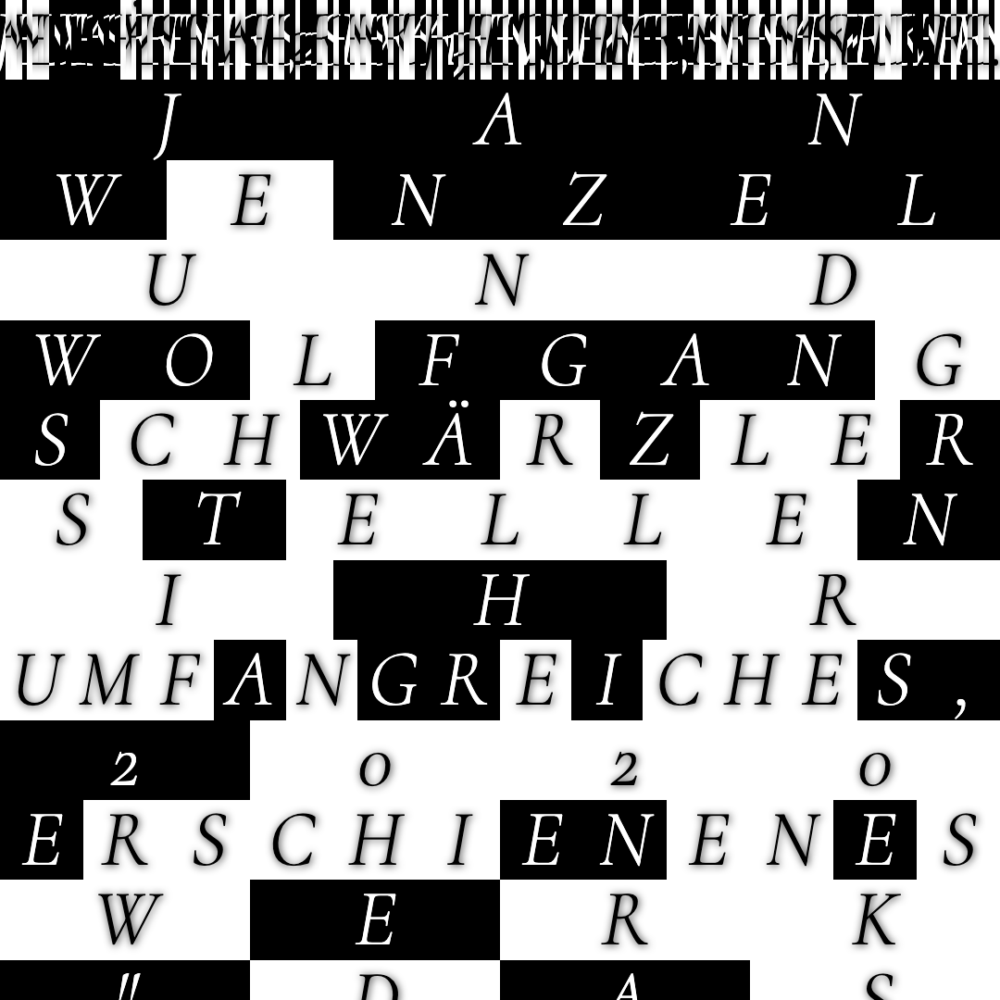

# Jitsi Bitsi Spider

Generative poster system for animated typographic posters.
Same speaker data in, different visual output. 9 poster patterns, 13 speakers.



## Posters

|   |   |   |   |
| --- | --- | --- | --- |
|  |  |  |  |
| TextExplosion | WordReveal | LetterGrid | LetterChase |
|  |  |  |  |
| ScreenFlicker | LetterScatter | PhysicsBlobs | StaticTypography |
|  | | | |
| ScrollCarousel | | | |

## How it works

Every poster is a factory function with the same signature:

```typescript
import { createLetterGrid } from './posters/letter-grid';

const cleanup = createLetterGrid(container, speaker, {
  colors: ['black', 'white'],
  speed: 1.5,
  intervals: { fast: 800, slow: 6000 },
  counts: { chunkSize: 4 },
});

// Later: cleanup() stops all animations and removes DOM
```

Feed it a container, a speaker, and optional config overrides. It builds DOM, starts animation, and returns a cleanup function.

## Run

```bash
npm install
npm run storybook        # localhost:6006
npm run typecheck        # tsc --noEmit
npm run build-storybook  # static build
npm run capture          # generate poster screenshots (requires Playwright)
```

## Stack

TypeScript, Storybook 10 (HTML), Vite 6, vanilla CSS (BEM).
Zero runtime dependencies.

## Context

Built for "Jitsi Bitsi Spider," a lecture series at Kunsthochschule Weissensee, Berlin (2020). The name is a nod to the nursery rhyme and the Jitsi video calls the lectures happened on.
